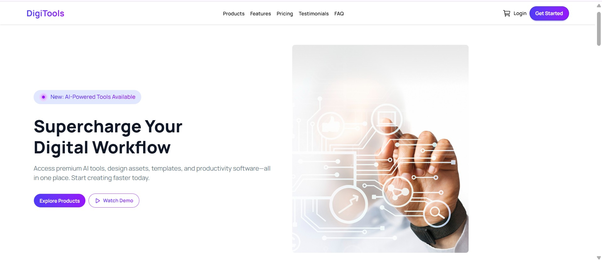
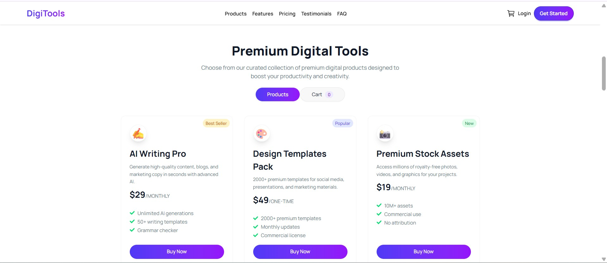
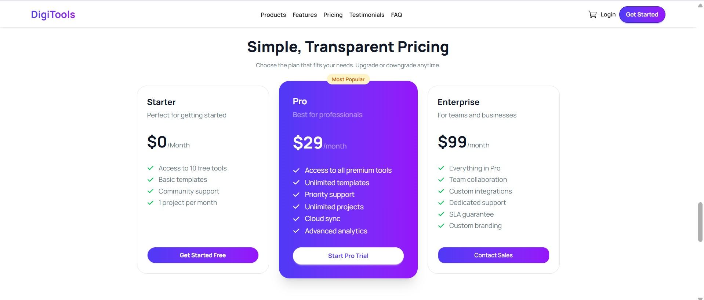
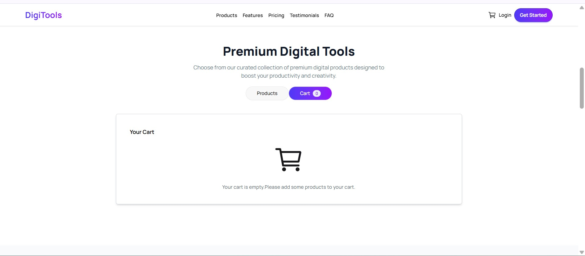
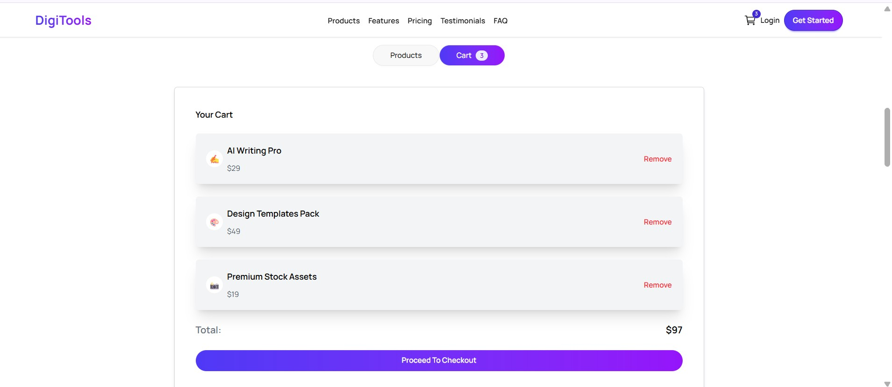

#  DigiTools - Premium Digital Assets Marketplace

DigiTools is a modern, high-performance web application designed for browsing and purchasing premium digital assets. Built with the latest technologies like **React 19** and **Tailwind CSS v4**, it offers a seamless user experience with real-time cart updates and smooth navigation.

---

##  Project Links

- **Live Site**: [https://digitoolkabir.netlify.app/](https://digitoolkabir.netlify.app/)
- **GitHub Repository**: [https://github.com/Kabir21Hossain/DigiTool_Site](https://github.com/Kabir21Hossain/DigiTool_Site)

---

##  Key Features

- **Dynamic Product Display**: Browse through a curated collection of premium digital tools fetched dynamically.
- **Advanced Cart System**: 
  - Add products to cart with real-time status updates on buttons.
  - Cart count badge in the navbar.
  - Dedicated Cart View with "Remove" functionality and Total Price calculation.
  - Empty cart state with intuitive UI.
- **Smooth Navigation**: 
  - One-page navigation with smooth scroll behavior.
  - Integrated Navbar-to-Cart switching logic.
- **Real-time Notifications**: Beautiful toast notifications for adding, removing, and duplicate item alerts using `React-Toastify`.
- **Premium UI/UX**: 
  - Built with **DaisyUI v5** for state-of-the-art components.
  - Fully responsive design (Mobile, Tablet, Desktop).
  - Hover effects, gradients, and micro-animations.

---

##  Technologies Used

- **Framework**: React 19 (using the new `use` hook and `Suspense`)
- **Styling**: Tailwind CSS v4 & DaisyUI v5
- **Icons**: React Icons (Io5, Fa, Im)
- **Notifications**: React Toastify
- **Build Tool**: Vite
- **Deployment**: Netlify

---

##  Screenshots

###  Desktop View - Hero Section


###  Premium Products Grid


###  Cart Management View


###  Responsive Design & Mobile UI


###  Real-time Notifications


---

##  Local Installation & Setup

1. **Clone the repository**:
   ```bash
   git clone https://github.com/Kabir21Hossain/DigiTool_Site.git
   ```

2. **Navigate to the project directory**:
   ```bash
   cd DigiTool-APP
   ```

3. **Install dependencies**:
   ```bash
   npm install
   ```

4. **Run the development server**:
   ```bash
   npm run dev
   ```

5. **Build for production**:
   ```bash
   npm run build
   ```

---

Developed with  by [Kabir Hossain](https://github.com/Kabir21Hossain)
